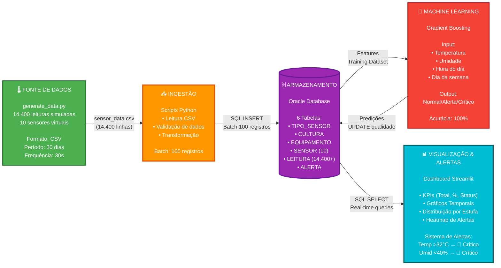

# 🏗️ Arquitetura Integrada - FarmTech Solutions

## 📐 Diagrama de Arquitetura (Simulação)



---

## 🔄 Fluxo de Dados

```
[1] FONTE DE DADOS (Simulação)
    │
    │  • generate_data.py gera 14.400 leituras
    │  • Simula 10 sensores (4 temp, 3 umidade, 2 umidade solo, 1 luminosidade)
    │  • 30 dias de dados, 1 leitura a cada 30s por sensor
    │  • Export: sensor_data.csv
    │
    ↓

[2] INGESTÃO
    │
    │  • Leitura do arquivo CSV
    │  • Parse de colunas (id_sensor, valor, data_hora, qualidade)
    │  • Validação (valores dentro do range)
    │  • Preparação para INSERT SQL
    │
    ↓

[3] ARMAZENAMENTO (Oracle DB)
    │
    │  • INSERT em lote (batch de 100)
    │  • Relacionamentos: SENSOR → LEITURA → ALERTA
    │  • Constraints e validações no banco
    │  • Índices para performance
    │
    ↓

[4] MACHINE LEARNING
    │
    │  • SELECT de dados históricos
    │  • Feature engineering (hora, dia, temperatura, umidade)
    │  • Treino do modelo Gradient Boosting
    │  • Validação cruzada (99.83% média)
    │  • Predição em novas leituras
    │  • UPDATE da qualidade no banco
    │
    ↓

[5] VISUALIZAÇÃO & ALERTAS
    │
    │  • Dashboard Streamlit conecta ao Oracle
    │  • Queries em tempo real
    │  • KPIs calculados (agregações SQL)
    │  • Gráficos renderizados (Plotly)
    │  • Alertas disparados por threshold
    │  • Notificações visuais (banner vermelho)
```

---

## 📊 Formatos de Dados

### **CSV (sensor_data.csv)**
```csv
id_sensor,tipo_sensor,equipamento,estufa,valor,data_hora,qualidade,hora_do_dia,dia_semana,is_dia
1,Temperatura,1,Estufa 1,22.30,2025-09-01 00:00:00,Normal,0,Sunday,False
1,Temperatura,1,Estufa 1,23.15,2025-09-01 00:30:00,Normal,0,Sunday,False
2,Umidade,1,Estufa 1,65.80,2025-09-01 00:00:00,Normal,0,Sunday,False
```

### **SQL (Oracle) - Após Ingestão**
```sql
INSERT INTO Leitura (id_sensor, valor, data_hora, qualidade)
VALUES (1, 22.30, TO_TIMESTAMP('2025-09-01 00:00:00', 'YYYY-MM-DD HH24:MI:SS'), 'Normal');
```

---

## ⚙️ Periodicidades

| Etapa | Frequência | Observação |
|-------|------------|------------|
| **Geração de dados** | Uma vez (setup inicial) | 14.400 registros |
| **Ingestão** | Batch (uma execução) | Carga inicial completa |
| **Consultas ML** | Sob demanda | Treino: 1x / Inferência: N vezes |
| **Dashboard refresh** | 30 segundos | Auto-refresh Streamlit |
| **Verificação alertas** | Real-time | A cada query no dashboard |

---

## 🎯 Componentes Detalhados

### **1. Fonte de Dados (Simulação)**
- **Script**: `scripts/generate_data.py`
- **Saída**: `data/sensor_data.csv` (14.400 linhas)
- **Colunas**: id_sensor, tipo_sensor, equipamento, estufa, valor, data_hora, qualidade, hora_do_dia, dia_semana, is_dia
- **Lógica**: Simula padrões realistas (variação dia/noite, sazonalidade, anomalias 2%)

### **2. Ingestão**
- **Origem**: `data/sensor_data.csv`
- **Script SQL**: `db/insert_leituras.sql` (gerado pelo generate_data.py)
- **Método**: INSERT batch (100 registros por lote)
- **Validação**: Tipos de dados, ranges, foreign keys

### **3. Armazenamento**
- **SGBD**: Oracle Database
- **Estrutura**: 6 tabelas normalizadas (3FN)
- **Modelo**: Ver `docs/database_doc.md`

### **4. Machine Learning**
- **Notebook**: `notebooks/modelo_classificacao_equipamento_2.ipynb`
- **Modelo**: Gradient Boosting (scikit-learn)
- **Artefatos**: `best_model.pkl`, `scaler.pkl`, `label_encoder.pkl`

### **5. Visualização**
- **Framework**: Streamlit
- **Arquivo**: `dashboard/app.py`
- **Biblioteca gráficos**: Plotly
- **Conexão DB**: oracledb (Python)

---

## 🚨 Thresholds de Alerta

```
╔══════════════╦═══════════╦═══════════╦═══════════╗
║  Métrica     ║  Normal   ║  Alerta   ║  Crítico  ║
╠══════════════╬═══════════╬═══════════╬═══════════╣
║ Temperatura  ║  18-28°C  ║ 15-18°C   ║  <15°C    ║
║              ║           ║ 28-32°C   ║  >32°C    ║
╠══════════════╬═══════════╬═══════════╬═══════════╣
║ Umidade      ║  50-80%   ║ 40-50%    ║  <40%     ║
║              ║           ║ 80-90%    ║  >90%     ║
╚══════════════╩═══════════╩═══════════╩═══════════╝
```

---

## 📝 Observações Importantes

### **Por que Simulação?**
- ✅ Não requer hardware físico (ESP32)
- ✅ Dados consistentes e reproduzíveis
- ✅ Volume grande (14.400 leituras) em segundos
- ✅ Permite testar cenários extremos (anomalias)
- ✅ Foco na arquitetura de software (ETL, ML, Dashboard)

### **Diferença vs. Produção Real**
| Aspecto | Simulação | Produção Real |
|---------|-----------|---------------|
| Fonte | `generate_data.py` | ESP32 + DHT22 via Serial |
| Formato | Arquivo CSV | MQTT ou HTTP (JSON) |
| Frequência | Batch único (14.400 registros) | Contínuo (streaming) |
| Ingestão | SQL batch (insert_leituras.sql) | Pipeline real-time (Python) |
| Dados | Sintéticos (30 dias gerados) | Medições reais |

### **Evolução Futura**
1. Substituir `generate_data.py` por ESP32 real
2. Implementar MQTT broker (Mosquitto)
3. Pipeline streaming (Apache Kafka/Spark)
4. Alertas via email/SMS
5. API REST para integração externa
