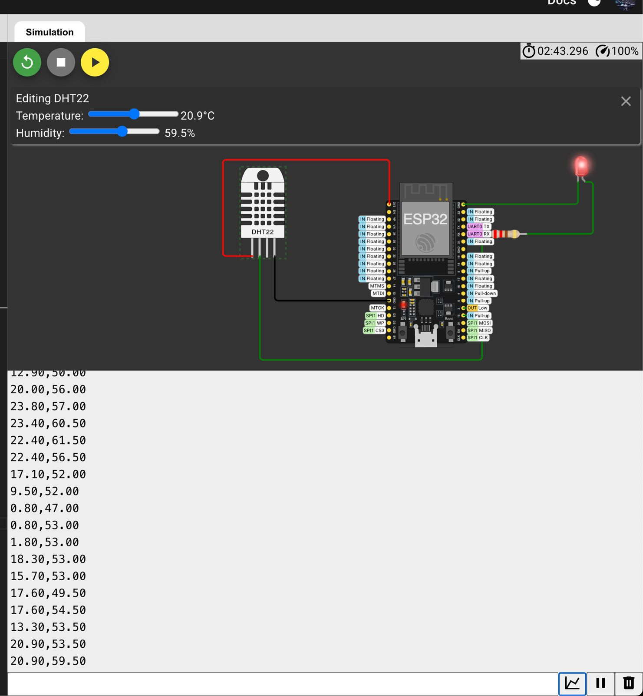

# 📥 Ingestão de Dados - FarmTech Solutions

## 📋 Conteúdo

Este diretório contém os arquivos relacionados à **coleta e ingestão de dados** dos sensores para o sistema FarmTech Solutions.

## 📁 Estrutura

```
ingest/
├── sketch.ino              # Código ESP32 + DHT22 (Arduino)
├── wokwi_link.txt          # Link do projeto Wokwi (simulação)
├── prints/                 # Evidências e screenshots
│   ├── circuit.png         # Imagem do circuito Wokwi
│   └── monitor_serial.png  # Print do monitor serial (a criar)
└── README.md               # Este arquivo
```

## 🔧 Componentes

### **sketch.ino**
Código Arduino para ESP32 com sensor DHT22.

**Características:**
- Sensor DHT22 no GPIO 15
- LED indicador no GPIO 2
- Serial: 115200 baud
- Leitura a cada 30 segundos
- Output formato CSV: `temperatura,umidade`

**Exemplo de saída:**
```
22.30,44.50
23.15,46.20
21.80,48.90
```

## 🌐 Simulação Wokwi

**Link do Projeto:** https://wokwi.com/projects/433508321885341697

**Como usar:**
1. Acesse o link acima
2. Clique em "Start Simulation"
3. Abra o Monitor Serial
4. Observe as leituras sendo geradas

## 📊 Fluxo de Ingestão (Simulação)

```
┌─────────────────────────────────────────────────────┐
│  ESP32 + DHT22 (Wokwi)                              │
│  - Leitura a cada 30s                               │
│  - Output: temp,humidity                            │
└────────────────┬────────────────────────────────────┘
                 │
                 ↓ Serial (115200 baud)
┌─────────────────────────────────────────────────────┐
│  generate_data.py (Substitui ESP32)                 │
│  - Gera 14.400 leituras simuladas                   │
│  - Export: sensor_data.csv                          │
└────────────────┬────────────────────────────────────┘
                 │
                 ↓ CSV File
┌─────────────────────────────────────────────────────┐
│  insert_leituras.sql                                │
│  - Batch INSERT (100 registros)                     │
│  - Carrega no Oracle DB                             │
└────────────────┬────────────────────────────────────┘
                 │
                 ↓
┌─────────────────────────────────────────────────────┐
│  Oracle Database                                    │
│  - Tabela LEITURA (14.400+ registros)               │
└─────────────────────────────────────────────────────┘
```

## 🎯 Próximos Passos (Produção Real)

Para evoluir de simulação para produção:

1. **Hardware físico:**
   - Adquirir ESP32 DevKit
   - Conectar sensor DHT22 real
   - Alimentação USB ou bateria

2. **Comunicação:**
   - Implementar MQTT (Mosquitto broker)
   - Ou HTTP POST para API REST
   - Autenticação e segurança

3. **Ingestão real-time:**
   - Script Python ouvindo MQTT
   - Parser de mensagens JSON
   - INSERT direto no banco

4. **Monitoramento:**
   - Dashboard de status dos sensores
   - Alertas quando sensor offline
   - Logs de erros de comunicação

## 🔍 Evidências

### **Circuito Wokwi**


### **Monitor Serial**
Print do monitor serial deve ser adicionado em `prints/monitor_serial.png`

## 📝 Observações

- Este é um **ambiente de simulação** para fins acadêmicos
- Não requer hardware físico (ESP32)
- Dados são gerados pelo `scripts/generate_data.py`
- O código ESP32 está funcional e pode ser usado com hardware real
- Link Wokwi permite visualizar simulação interativa

---

**FarmTech Solutions - Sprint 3**
**Última atualização:** 02/10/2025
